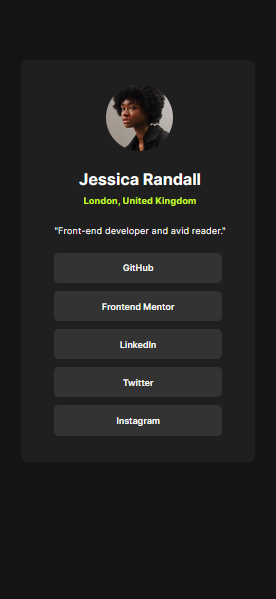
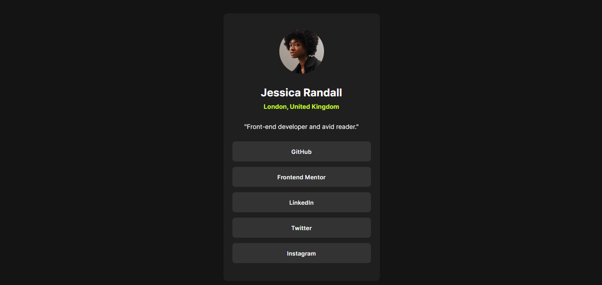

# Frontend Mentor - Social links profile solution

This is a solution to the [Social links profile challenge on Frontend Mentor](https://www.frontendmentor.io/challenges/social-links-profile-UG32l9m6dQ). Frontend Mentor challenges help you improve your coding skills by building realistic projects. 

## Table of contents

- [Overview](#overview)
  - [The challenge](#the-challenge)
  - [Screenshot](#screenshot)
  - [Links](#links)
- [My process](#my-process)
  - [Built with](#built-with)
  - [What I learned](#what-i-learned)
- [Author](#author)

## Overview

### The challenge

Users should be able to:

- See hover and focus states for all interactive elements on the page

## Screenshots

### Mobile


### Desktop


### Links

- Solution URL: [Frontend Mentor Challengue](https://www.frontendmentor.io/solutions/social-links-profile-nDVpHe6z_Y)
- Live Site URL: [DEMO](https://juanblancodev.github.io/social-links-profile/)

## My process

### Built with

- Semantic HTML5 markup
- CSS custom properties
- Flexbox
- CSS Grid
- Mobile-first workflow
- [React](https://reactjs.org/) - JS library
- [Styled Components](https://styled-components.com/) - For styles

### What I learned

I used styled-components better and worked together with my own CSS classes to avoid repeating code in styled-components

```jsx
// Use styled-components
const Wrapper = styled.div`
  width: 100%;
  height: 100vh;

  display: flex;
  justify-content: center;
`

const Content = styled.div`
  margin-top: 70px;
  width: 350px;
  height: 600px;

  padding: 35px 50px;

  border-radius: 10px;
  background-color: var(--color-dark-rey);

  @media (height < 740px){
    padding: 35px 20px;
    margin-top: 10px;
  }
`

return(
  <Wrapper>
    <Content></Content>
  </Wrapper>
)
```

## Author

- Frontend Mentor - [@JuanBlancodev](https://www.frontendmentor.io/profile/JuanBlancodev)
- GitHub - [@JuanBlancodev](https://github.com/JuanBlancodev)
